# Godot Vibe Suite

Suíte de plugins para **Godot 4.3+** que cria mundos 3D — **terreno**, **grama**, **árvores e
rochas**, **céu, água e VFX** e **personagens com animações geradas por texto** — tanto de forma
visual no editor quanto por **comandos no terminal**, pensada para *vibecoding* com o
**Claude Code**: você descreve o mundo ("ilha ao pôr do sol com palmeiras e alguém dançando perto
da fogueira"), o Claude executa os comandos, tira screenshots, olha o resultado e refina.

[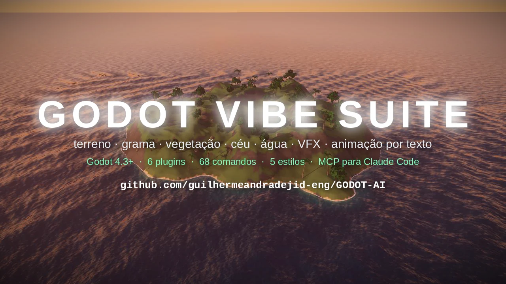](docs/video/trailer.mp4)

**▶ [Assista ao trailer (60 s)](docs/video/trailer.mp4)** — cada imagem do vídeo foi renderizada pelos
próprios plugins, e até a trilha sonora é gerada por código (`python3 tools/make_trailer.py`).

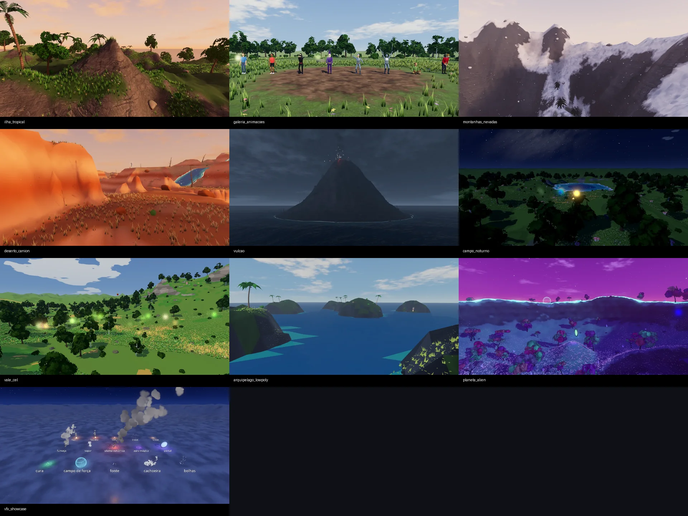

> Todas as imagens acima foram geradas pelos próprios plugins, a partir das receitas em
> [`recipes/`](recipes/) (`python3 tools/build_demos.py`). Abra o projeto e rode (F5) para
> explorar cada mundo pelo hub de demos.

## O que vem na suíte

| Plugin | Nó / recurso | Destaques |
|---|---|---|
| **vibe_terrain** | `VibeTerrain3D` | heightmap com deslocamento na GPU, chunks com LOD e *skirts*, colisão `HeightMapShape3D`; 11 geradores (ilha, arquipélago, montanhas, cânion, vulcão, vale, dunas, cratera...); pincéis raise/lower/smooth/flatten/set/noise/terrace; carimbos (montanha, cratera, lago, vulcão, platô); rios e estradas escavados; erosão hidráulica e térmica; 4 camadas pintáveis com mistura por altura, *detiling* e triplanar; 11 paletas de bioma; mar, lagos e rios; anel de horizonte com colinas distantes; import/export de heightmap |
| **vibe_grass** | `VibeGrass3D` | grama em MultiMesh por chunks (LOD perto/longe), densidade pintada ou por regras (altura, inclinação, camada, longe da água, manchas naturais), vento por ruído, *subsurface*, flores, trigo, juncos, grama alienígena luminosa, interação com o jogador; tinge o chão do terreno para continuar "verde" ao longe |
| **vibe_scatter** | `VibeScatter3D` | árvores, arbustos e props gerados proceduralmente (17 presets: floresta, outono, pinheiros, palmeiras, selva, bétulas, acácias, árvores secas, arbustos, samambaias, cactos, rochas, matacões, cogumelos, cristais, troncos, árvores alienígenas; 4 variações cada), instanciados com LOD, vento, translucidez das folhas, neve/musgo no topo e colisão; regras de inclinação/altura/água, bosques naturais e clareiras automáticas em volta de fogueiras e personagens |
| **vibe_motion** | `VibeCharacter3D` | **texto → animação** (PT/EN): "anda devagar, acena duas vezes e depois senta triste" vira uma animação de esqueleto humanoide (50 ações, humores, estilos, sequências, "enquanto"); personagens procedurais com 12 roupas; backend opcional de IA **Kimodo** (servidor do kimodo.cpp); importação de mocap BVH/glTF/FBX com *retargeting*; prévias em folha de poses |
| **vibe_vfx** | `VibeVFX3D` | 25 efeitos definidos em dados (fogo, fogueira, tocha, brasas, faíscas, fumaça, vapor, explosão, pluma vulcânica, aura mágica, portal, cura, vagalumes, chuva, neve, poeira, folhas, névoa, fonte, cachoeira, bolhas, raios, onda de choque, campo de força, confete), cor/escala/intensidade ajustáveis, efeitos próprios em JSON; céu com nuvens iluminadas, lua e estrelas; 8 atmosferas; pós-processamento por estilo e por qualidade (SSAO, SSIL, névoa volumétrica, SDFGI, sombras suaves, *color grading*) |
| **vibe_core** | comandos | 68 comandos com descoberta automática, ponte HTTP com o editor aberto (ao vivo, com Ctrl+Z), CLI headless, prompts em PT/EN (`vibe`), receitas declarativas (`world.build`), estilos de arte, screenshots, servidor MCP |

### Cinco estilos de arte

`style.set` troca tudo de uma vez — terreno, água, grama, efeitos, céu e pós-processamento:

| `realistic` | `stylized` | `toon` | `cel` | `lowpoly` |
|---|---|---|---|---|
| texturas PBR (fotos CC0) com mistura por altura e triplanar | pintado à mão, sombras coloridas | faixas de luz suaves, contorno de luz | anime, 2 tons duros | facetado, cores por triângulo |

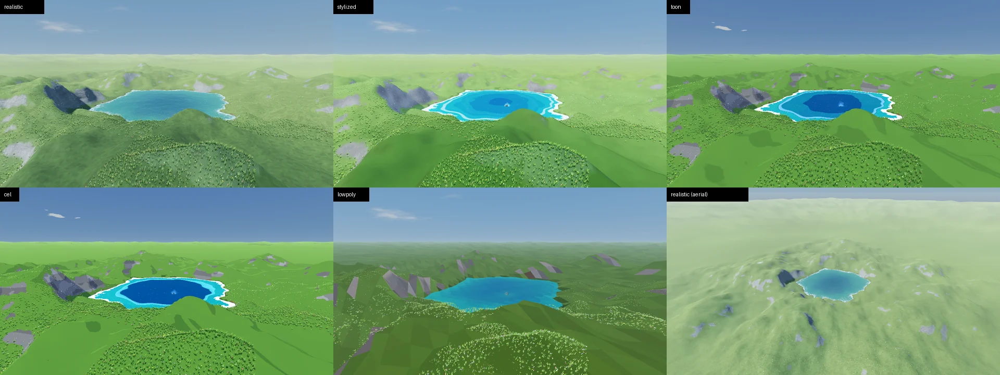

## Demos

| | |
|---|---|
| 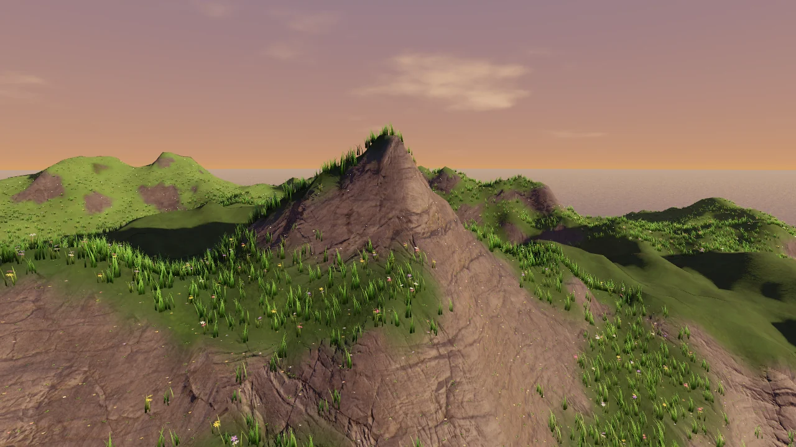 **Ilha tropical** — realistic, pôr do sol, palmeiras | 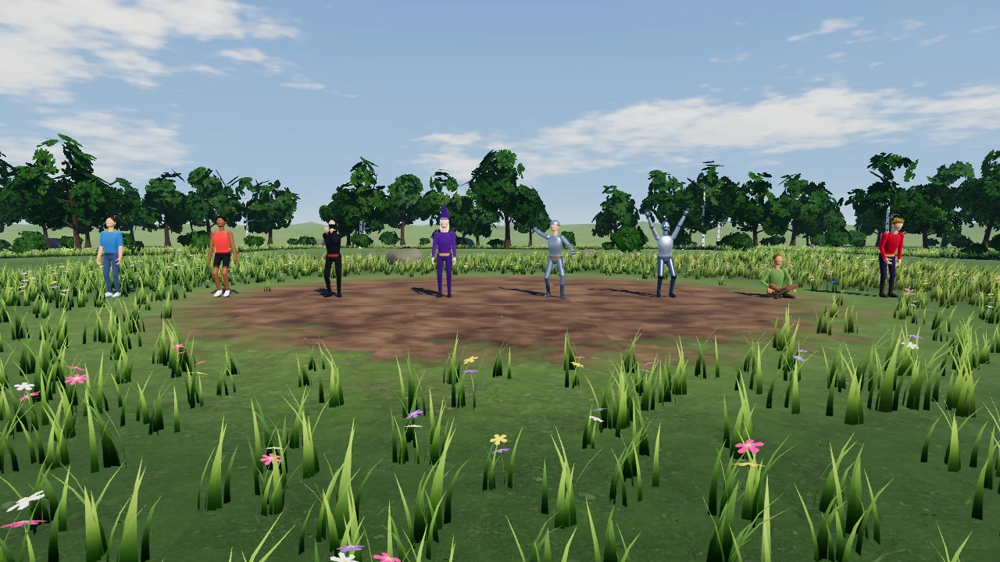 **Galeria de animações** — 8 animações geradas por texto |
| 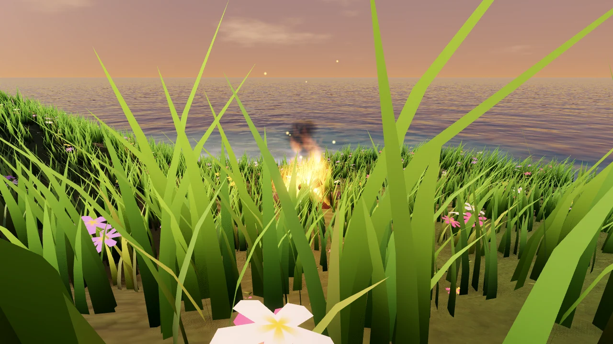 fogueira na praia: personagens sentados e dançando | 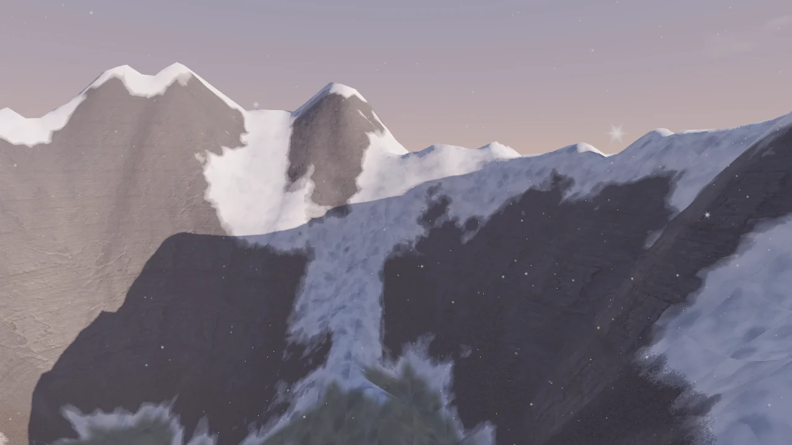 **Montanhas nevadas** — realistic, amanhecer, pinheiros |
| 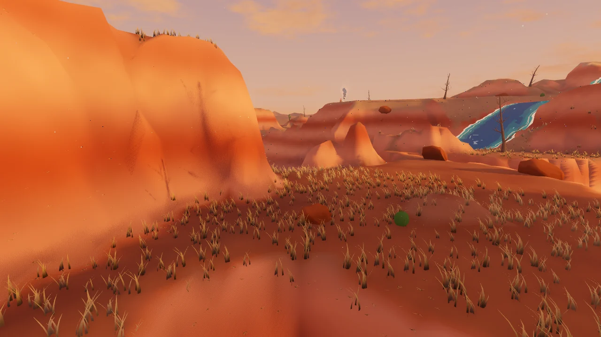 **Cânion no deserto** — stylized, rio esculpido | 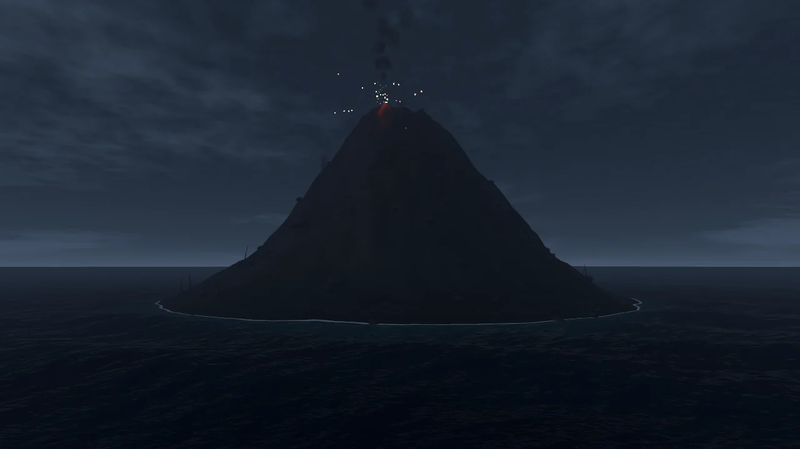 **Ilha vulcânica** — tempestade, lava, pluma e raios |
| 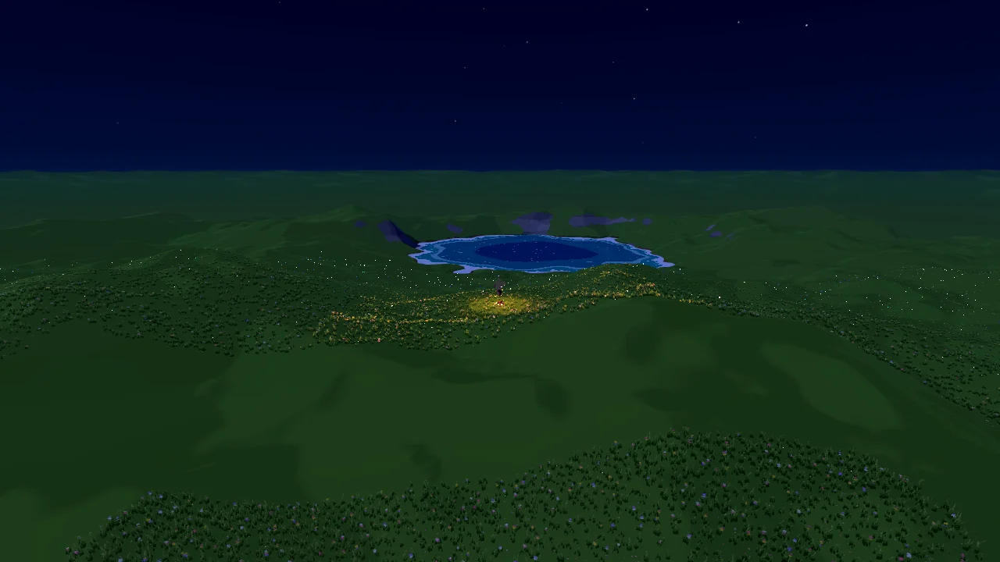 **Campo noturno** — toon, lago, vagalumes, portal | 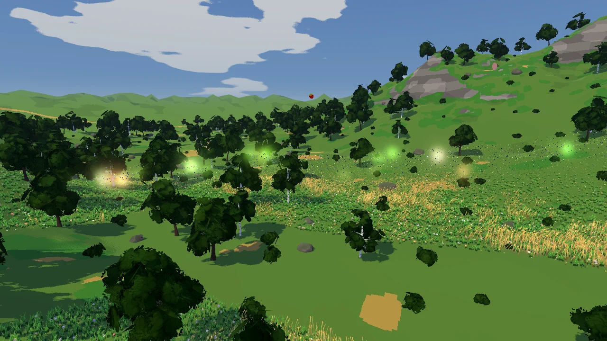 **Vale anime** — cel shading, rio, trigo |
| 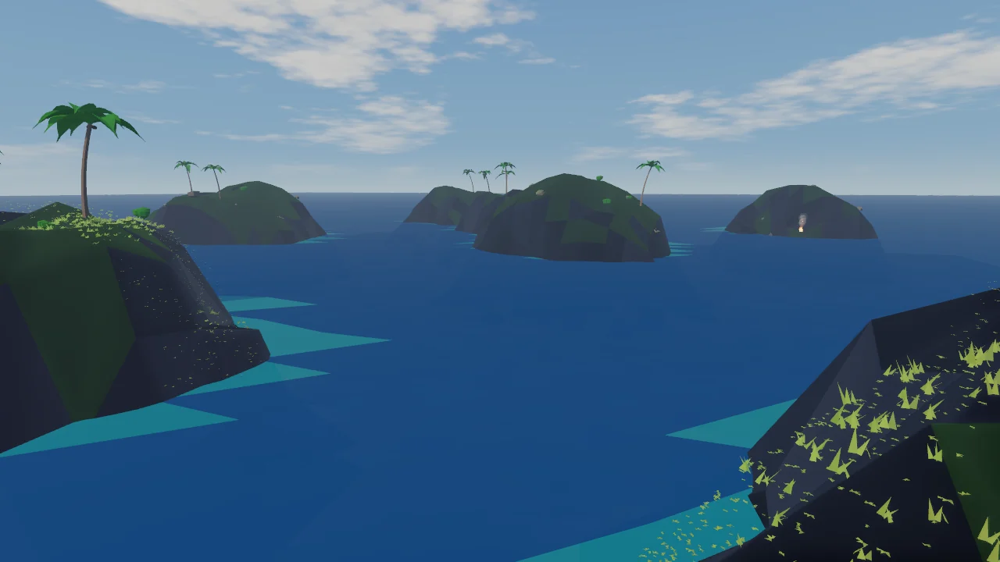 **Arquipélago** — low poly | 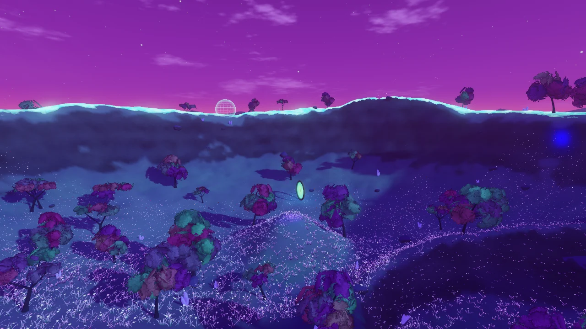 **Planeta alienígena** — grama luminosa, cristais |
| 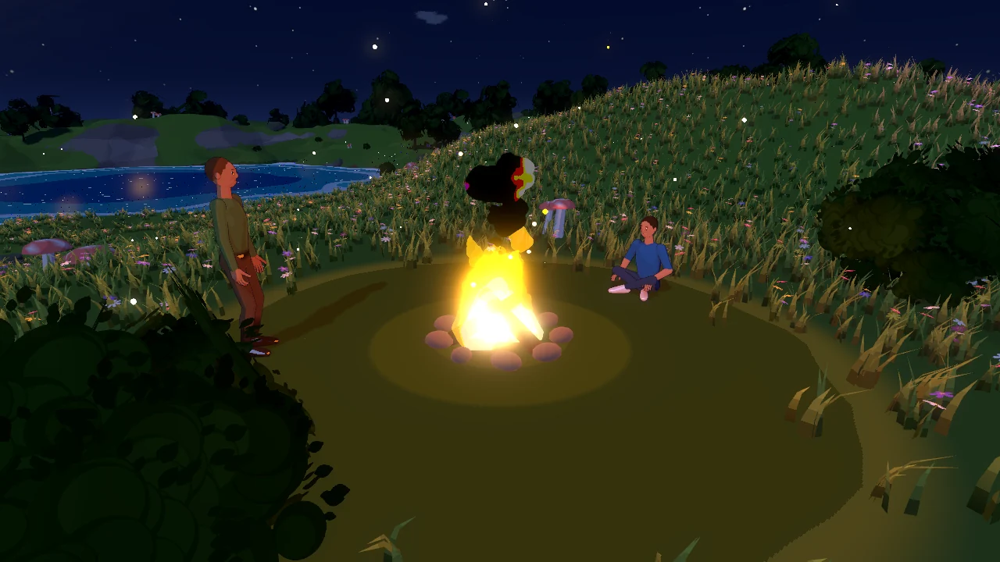 acampamento noturno (toon) | 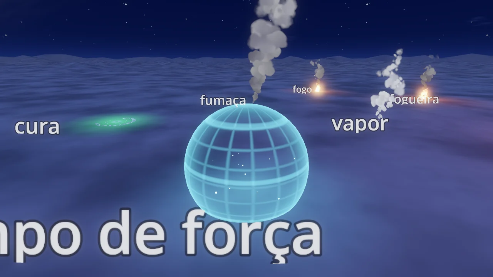 **Vitrine de VFX** — campo de força |

## Animações por texto (vibe_motion)

Descreva o movimento em português ou inglês e o personagem anima — sem mocap, sem rig manual:

```bash
python3 tools/vibe.py motion.character outfit=knight name=Cavaleiro position=near:Fogueira text="acena e depois dança"
python3 tools/vibe.py motion.generate character=Cavaleiro text="anda devagar em círculo enquanto acena, depois senta triste"
python3 tools/vibe.py motion.describe text="corre, pula três vezes e comemora"      # como o texto foi entendido
python3 tools/vibe.py motion.render character=Cavaleiro mode=sheet                  # folha de poses (PNG)
```

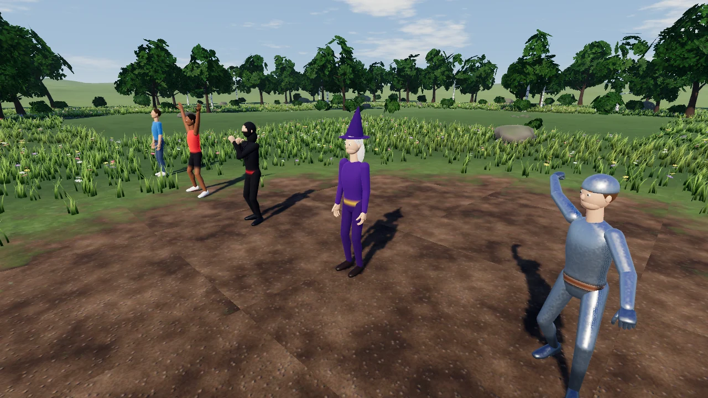

- **50 ações**: andar, correr, esgueirar, marchar, pular, polichinelos, girar, acenar, apontar,
  bater palmas, comemorar, dançar, sentar (cadeira/chão), meditar, ajoelhar, deitar, cair, morrer,
  socar, chutar, golpe de espada, lançar feitiço, arremessar, empurrar, pegar, reverência, continência...
- **Frases compostas**: sequências ("e depois", "then"), sobreposição ("anda **enquanto** acena"),
  contagens ("3 vezes"), durações, velocidade, lado ("mão esquerda"), direção ("em círculo",
  "para trás"), humor ("triste", "animado", "cansado") e estilo ("como um robô", "como um zumbi").
- **Personagens** `VibeCharacter3D` com esqueleto humanoide padrão do Godot e 12 roupas (casual,
  aventureira, atleta, ninja, robô, soldado, cavaleiro, mago, zumbi, astronauta, rei, manequim) nos 5
  estilos; animações salvas em `res://animations/` e reaproveitáveis em qualquer personagem.
- **IA opcional**: com um servidor do **kimodo.cpp** rodando, `motion.backend
  url=http://127.0.0.1:8090` troca o sintetizador embutido pelo modelo Kimodo (texto → movimento).
- **Mocap**: `motion.import path=res://mocap/pulo.bvh` (BVH, glTF/GLB, FBX — Mixamo, CMU...) com
  *retargeting* para o humanoide.
- **Em jogo**: `$Cavaleiro.play("danca")` ou `$Cavaleiro.generate("pula e comemora")`.

## Vegetação (vibe_scatter)

```bash
python3 tools/vibe.py scatter.auto                                          # vegetação natural da paleta do terreno
python3 tools/vibe.py scatter.add preset=pinheiros density=1.2 rules='{"max_height_frac": 0.6}'
python3 tools/vibe.py scatter.paint name=Pines position=center radius=20 erase=true   # clareira
```

Árvores e rochas são geradas por código (4 variações por tipo), com cores da paleta (verde,
outono, neve, deserto, alienígena...), vento, LOD e colisão. Fogueiras, portais e personagens
ganham uma clareira automática.

## Gráficos

- **Céu**: degradê com cor intermediária, névoa no horizonte, brilho do sol, nuvens *cumulus*
  iluminadas (bordas prateadas contra o sol) e *cirrus*, lua com relevo, estrelas e Via Láctea.
- **Água**: ondas Gerstner no mar, mapas normais animados, refração do fundo com absorção pela
  profundidade (água rasa turquesa, funda azul), linhas de espuma na praia e cristas brancas.
- **Luz e pós-processamento** (`env.set quality=low|medium|high|ultra`): SSAO, SSIL, névoa volumétrica
  com raios de sol, sombras suaves (PCSS), SDFGI no `ultra`, tonemap ACES/AgX e *color grading* por
  atmosfera. Tudo funciona também no renderizador Compatibility (os efeitos só do Forward+ são
  desligados automaticamente em projetos Mobile/Compatibility).
- **Terreno**: sombreamento de cavidades pelo heightmap (vales escuros, cristas claras), mistura
  por altura, triplanar nas encostas e variação de macroescala.

### Biblioteca de VFX

Os 25 efeitos vêm de dados (JSON) e aceitam cor, escala, intensidade e estilo. Os 20 efeitos
posicionáveis, de perto (demo `vfx_showcase`); chuva, neve, poeira, folhas e névoa seguem a câmera:

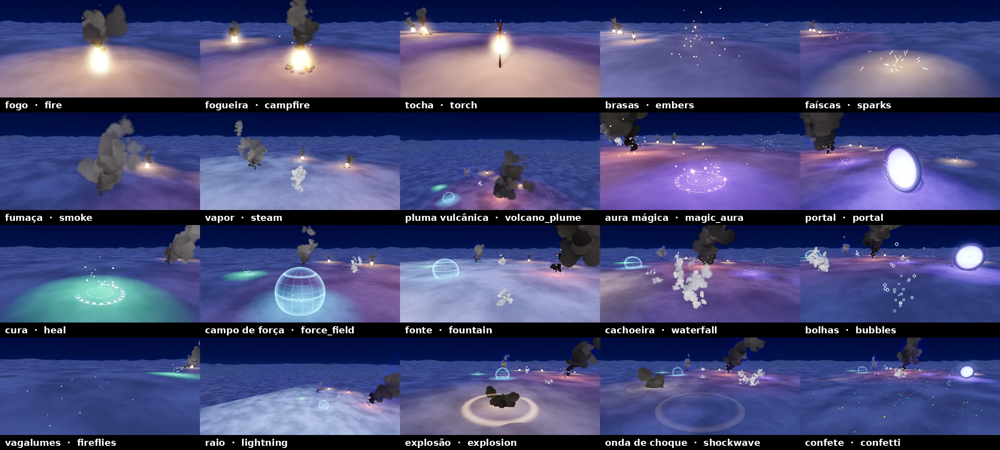

Cada demo é uma receita JSON em [`recipes/`](recipes/) — o mesmo formato que o Claude usa para
montar mundos. Para reconstruir: `python3 tools/build_demos.py [nome]`.

Rodando o projeto (F5) abre o hub; em cada demo: botão direito + mouse para olhar, WASD para voar,
**M** volta ao menu.

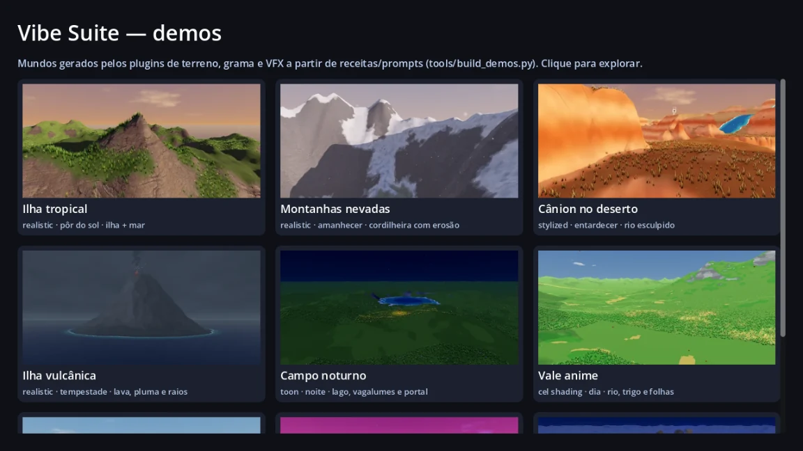

## Instalação

**Requisitos:** Godot **4.3 ou superior** (testado em 4.3 e 4.7) e Python 3.9+ (só biblioteca padrão)
para as ferramentas de terminal.

- **Usar este repositório:** abra `project.godot` no Godot. Os seis plugins já vêm ativados e a
  cena principal é o hub de demos.
- **Instalar no seu projeto:**

  ```bash
  python3 tools/install.py /caminho/do/meu_jogo        # plugins + ferramentas + setup do Claude Code
  ```

  Copia `addons/vibe_*`, `tools/vibe*.py`, ativa os plugins no `project.godot`, adiciona o servidor
  MCP `godot-vibe` ao `.mcp.json`, os slash commands em `.claude/commands/` e uma seção no `CLAUDE.md`.
  Também dá para copiar só as pastas `addons/vibe_*` e ativar em *Projeto → Configurações → Plugins*.

Diga ao terminal onde está o Godot, se ele não estiver no PATH: `export GODOT_BIN=/caminho/godot`.
Depois do primeiro uso o caminho fica salvo em `.vibe/state.json`, e o servidor MCP (que o Claude
Code inicia sem essa variável) passa a encontrá-lo sozinho.

## Vibecoding com o Claude Code

Abra o Claude Code na pasta do projeto. Ele lê o [`CLAUDE.md`](CLAUDE.md) e passa a usar a suíte:

```text
> /mundo ilha vulcânica ao pôr do sol com um rio de lava, praias e fogueiras
> /terreno uma cordilheira ao norte e um lago no vale
> /grama flores só perto do lago e capim alto nas colinas
> /vfx portal azul no topo do morro e vagalumes perto da água
> /vegetacao floresta de pinheiros nas encostas e rochas perto do rio
> /animacao um mago lança um feitiço no portal e um cavaleiro faz reverência
> /estilo comparar
> /screenshot hero
```

Ou peça em linguagem natural ("deixa o céu mais dramático", "cava um rio até o mar"). O Claude
chama os comandos, renderiza `screenshot`, **olha a imagem** e ajusta.

Duas formas de conexão, escolhidas automaticamente:

- **Editor aberto (ao vivo):** o plugin abre uma ponte HTTP local (127.0.0.1, com token); cada
  comando aparece na hora no editor e pode ser desfeito com Ctrl+Z.
- **Sem editor (headless):** o Godot roda em segundo plano, aplica os comandos na cena e salva.

Servidor **MCP** (`.mcp.json` → `python3 tools/vibe_mcp.py`): expõe os 68 comandos como ferramentas;
`screenshot` devolve a imagem para o modelo ver.

### Pelo terminal (sem IA)

```bash
python3 tools/vibe.py status
python3 tools/vibe.py vibe "montanhas nevadas ao amanhecer com um lago" scene=res://scenes/mundo.tscn
python3 tools/vibe.py terrain.stamp shape=volcano position=north radius=40 height=60
python3 tools/vibe.py terrain.carve_path mode=river
python3 tools/vibe.py grass.create preset=flowers name=Flores
python3 tools/vibe.py grass.fill grass=Flores density=0.4 max_slope=25
python3 tools/vibe.py vfx.spawn preset=campfire position=flat
python3 tools/vibe.py scatter.auto
python3 tools/vibe.py motion.character outfit=wizard position=near:Portal text="lança um feitiço"
python3 tools/vibe.py env.set preset=sunset quality=high
python3 tools/vibe.py style.set style=toon
python3 tools/vibe.py screenshot view=hero            # imprime o caminho do PNG
python3 tools/vibe.py help terrain.sculpt             # argumentos de qualquer comando
python3 tools/vibe.py world.build path=res://recipes/vulcao.json
```

Argumentos são `chave=valor` com valores JSON (`12`, `true`, `[10,-5]`, `{"a":1}`). Posições aceitam
`[x, z]` (encaixa no chão), `[x, y, z]` ou âncoras: `center`, `north`, `peak`, `valley`, `flat`,
`beach`, `water`, `random`...

### Receitas

```json
{
  "scene": "res://scenes/ilha.tscn",
  "style": "realistic",
  "environment": "sunset",
  "terrain": {"preset": "island", "size": 256, "seed": 11, "palette": "tropical", "water": true,
              "features": [{"type": "river"}, {"type": "mountain", "at": "north", "radius": 40, "height": 50}]},
  "grass": [{"preset": "lush", "density": 0.9}, {"preset": "flowers", "name": "Flores", "density": 0.3}],
  "vfx": [{"preset": "campfire", "name": "Fogueira", "at": "beach"}, {"preset": "fireflies", "count": 2}],
  "characters": [{"outfit": "adventurer", "at": "near:Fogueira", "motion": "senta no chão e olha em volta"}],
  "scatter": [{"preset": "palms", "density": 1.2}, {"preset": "rocks", "density": 0.5}],
  "camera": {"type": "fly", "view": "hero"},
  "commands": [{"cmd": "node.add", "args": {"type": "OmniLight3D", "position": [0, 8, 0]}}]
}
```

## No editor (visual)

- Selecione um `VibeTerrain3D`: painel **Terreno** com pincéis (esculpir, suavizar, nivelar,
  pintar camadas) — clique e arraste no terreno; Shift suaviza, Ctrl inverte, `[` `]` mudam o
  tamanho; geradores de relevo e paletas de bioma com um clique.
- `VibeGrass3D`: painel **Grama** com pincel de densidade (pintar/apagar), presets e preenchimento por regras.
- `VibeVFX3D`: painel **VFX** com a biblioteca de efeitos e atmosferas; ajuste fino no inspetor.
- Painel **Vibe** (vibe_core): digite um prompt ou comando e veja o log; mostra o estado da ponte.
- Todas as propriedades são exportadas (inspetor) e as edições entram no histórico de desfazer.

## Em jogo (GDScript)

```gdscript
var fx := VibeVFX3D.spawn(self, "explosion", global_position, {"size": 2.0})
var h: float = $Terrain.get_height_at_world(player.global_position)
var hit = $Terrain.raycast(origin, direction)          # Vector3 ou null
$Grass.interact_node = player.get_path()             # a grama se abre ao passar
```

A câmera livre das demos (`addons/vibe_core/runtime/vibe_fly_camera.gd`): botão direito + mouse
para olhar, WASD para mover, E/Q para subir/descer, Shift para acelerar.

## Estrutura

```
addons/vibe_core/      comandos, ponte do editor, CLI headless, prompts, receitas, estilos
addons/vibe_terrain/   VibeTerrain3D, geradores, pincéis, paletas, shaders, texturas
addons/vibe_grass/     VibeGrass3D, presets, malhas de tufos, shaders
addons/vibe_vfx/       VibeVFX3D, biblioteca de efeitos, ambientes/céu, shaders, sprites
addons/vibe_scatter/   VibeScatter3D, modelos procedurais de árvores/rochas, shaders de folhagem
addons/vibe_motion/    VibeCharacter3D, sintetizador texto → animação, Kimodo, retargeting de mocap
tools/                 vibe.py (CLI), vibe_mcp.py (MCP), build_demos.py, make_trailer.py, install.py
recipes/               receitas das demos
demos/                 cenas das demos + hub
tests/                 run_tests.py, render_gallery.py
```

## Testes

```bash
GODOT_BIN=/caminho/godot python3 tests/run_tests.py            # importação, comandos, prompts, schema, MCP
GODOT_BIN=/caminho/godot python3 tests/run_tests.py --render   # + renderiza os 5 estilos (janela ou xvfb-run)
GODOT_BIN=/caminho/godot python3 tests/run_tests.py --editor   # + abre o editor e testa a ponte ao vivo (HTTP)
python3 tests/render_gallery.py --export                       # galeria de estilos (docs/img/estilos.webp)
python3 tools/build_demos.py [demo]                            # reconstrói as demos e as imagens do README
python3 tools/make_trailer.py                                  # grava as tomadas e monta docs/video/trailer.mp4
```

## Créditos

Texturas fotográficas CC0 da [ambientCG](https://ambientcg.com) (via demo do Terrain3D) e do
[godot-demo-projects](https://github.com/godotengine/godot-demo-projects) (MIT); demais texturas e
sprites gerados proceduralmente (CC0). Técnicas de shader inspiradas em Terrain3D, GodotGrass,
FlexibleToonShaderGD e GDQuest — detalhes em [THIRD_PARTY_NOTICES.md](THIRD_PARTY_NOTICES.md).
